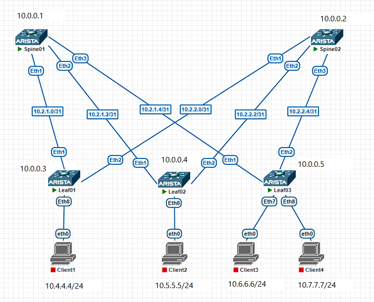

# Lab01.  Основы проектирования сети.

## Задание:
1. Собрать топологию CLOS, как на схеме;
2. Распределить адресное пространство для Underlay сети;
3. Зафиксировать в документации план работ, адресное пространство, схему сети, настройки.

### Схема сети:


## Выполнение
Выделим адресное пространство.

Для IPv4 будем использовать адреса из сети 10.0.0.0/13 (RFC 1918).

Для IPv6 будем использовать случайно сгенерированный Unique Local префикс fdcd:c467:a7d3::0/48 (RFC 4193) и Link-local адреса fe80::/10.

Для сети управления (out-of-band management) будем использовать сеть 172.16.0.0/24.

### Таблица сетей:
|Сеть IPv4|Сеть IPv6|Назначение|
|--|--|--|
|10.0.0.0/13    |fdcd:c467:a7d3:1::/64      |Весь диапазон|
|10.0.0.0/24    |fdcd:c467:a7d3:1:0::/80    |Loopback 1|
|10.1.0.0/24    |fdcd:c467:a7d3:1:1::/80    |Loopback 2|
|10.2.0.0/24    |-                          |point to point линки|
|10.3.0.0/24    |-                          |Резерв|
|10.4.0.0/14    |-                          |Сервисы|
|172.16.0.0/24  |-                          |Management|
|-              |fe80::/10                  |Link-local|

### Соберем схему в PNETLab:


Назначим адреса на устройства, согласно таблице.

### Таблица адресов:
|Устройство|Интерфейс|Адрес IPv4|Адрес IPv6|Назначение|
|--|--|--|--|--|
|Spine01    |Man1   |172.16.0.1/24  |-                          |OOB|
|           |Lo0    |10.0.0.1/32    |fdcd:c467:a7d3:1:0::1/128  |Loopback 1|
|           |Lo1    |10.1.0.1/32    |fdcd:c467:a7d3:1:1::1/128  |Loopback 2|
|			|Eth1   |10.2.1.0/31    |-                          |p2p to Leaf1|
|			|Eth1   |-              |fe80::1/64                 |Link-local|
|			|Eth2   |10.2.1.2/31    |-                          |p2p to Leaf2|
|			|Eth2   |-              |fe80::1/64                 |Link-local|
|			|Eth3   |10.2.1.4/31    |-                          |p2p to Leaf3|
|			|Eth3   |-              |fe80::1/64                 |Link-local|
|Spine02    |Man1   |172.16.0.2/24  |-                          |OOB|
|           |Lo0    |10.0.0.2/32    |fdcd:c467:a7d3:1:0::2/128  |Loopback 1|
|			|Lo1    |10.1.0.2/32    |fdcd:c467:a7d3:1:1::2/128  |Loopback 2|
|			|Eth1   |10.2.2.0/31    |-                          |p2p to Leaf1|
|			|Eth1   |-              |fe80::2/64                 |Link-local|
|			|Eth2   |10.2.2.2/31    |-                          |p2p to Leaf2|
|			|Eth2   |-              |fe80::2/64                 |Link-local|
|			|Eth3   |10.2.2.4/31    |-                          |p2p to Leaf3|
|			|Eth3   |-              |fe80::2/64                 |Link-local|
|Leaf01     |Man1   |172.16.0.3/24  |-                          |OOB|
|           |Lo0    |10.0.0.3/32    |fdcd:c467:a7d3:1:0::3/128  |Loopback 1|
|			|Lo1    |10.1.0.3/32    |fdcd:c467:a7d3:1:1::3/128  |Loopback 2|
|			|Eth1   |10.2.1.1/31    |-                          |p2p to Spine01|
|			|Eth1   |-              |fe80::3/64                 |Link-local|
|			|Eth2   |10.2.2.1/31    |-                          |p2p to Spine02|
|			|Eth2   |-              |fe80::3/64                 |Link-local|
|Leaf02     |Man1   |172.16.0.4/24  |-                          |OOB|
|           |Lo0    |10.0.0.4/32    |fdcd:c467:a7d3:1:0::4/128  |Loopback 1|
|			|Lo1    |10.1.0.4/32    |fdcd:c467:a7d3:1:1::4/128  |Loopback 2|
|			|Eth1   |10.2.1.3/31    |-                          |p2p to Spine01|
|			|Eth1   |-              |fe80::4/64                 |Link-local|
|			|Eth2   |10.2.2.3/31    |-                          |p2p to Spine02|
|			|Eth2   |-              |fe80::4/64                 |Link-local|
|Leaf03     |Man1   |172.16.0.5/24  |-                          |OOB|
|           |Lo0    |10.0.0.5/32    |fdcd:c467:a7d3:1:0::5/128  |Loopback 1|
|			|Lo1    |10.1.0.5/32    |fdcd:c467:a7d3:1:1::5/128  |Loopback 2|
|			|Eth1   |10.2.1.5/31    |-                          |p2p to Spine01|
|			|Eth1   |-              |fe80::5/64                 |Link-local|
|			|Eth2   |10.2.2.5/31    |-                          |p2p to Spine02|
|			|Eth2   |-              |fe80::5/64                 |Link-local|


Для примера приведем конфигурации Spine01 и Leaf01.

### конфигурация Spine01:
```
Spine01(config)

hostname Spine01

interface Management1
    mac-address 00:00:00:01:01:01
	ip address 172.16.0.1/24

interface loopback 0
    ip address 10.0.0.1/32
    ipv6 enable
    ipv6 address fdcd:c467:a7d3:1:0::1/128

interface loopback 1
    ip address 10.1.0.1/32
    ipv6 enable
    ipv6 address fdcd:c467:a7d3:1:1::1/128

interface ethernet 1 - 3
    ipv6 address fe80::1 link-local

interface ethernet 1
    description p2p to Leaf01
    mac-address 00:00:00:01:00:01
    no switchport
    ip address 10.2.1.0/31
    ipv6 enable

interface ethernet 2
    description p2p to Leaf02
    mac-address 00:00:00:01:00:02
    no switchport
    ip address 10.2.1.2/31
    ipv6 enable

interface ethernet 3
    description p2p to Leaf03
    mac-address 00:00:00:01:00:03
    no switchport
    ip address 10.2.1.4/31
    ipv6 enable

interface ethernet 4
    mac-address 00:00:00:01:00:04
interface ethernet 5
    mac-address 00:00:00:01:00:05
interface ethernet 6
    mac-address 00:00:00:01:00:06
interface ethernet 7
    mac-address 00:00:00:01:00:07
interface ethernet 8
    mac-address 00:00:00:01:00:08
```


### конфигурация Leaf01:
```
Leaf01(config)

hostname Leaf01

interface Management1
    mac-address 00:00:00:03:01:01
	ip address 172.16.0.3/24

interface loopback 0
    ip address 10.0.0.3/32
    ipv6 enable
    ipv6 address fdcd:c467:a7d3:1:0::3/128

interface loopback 1
    ip address 10.1.0.3/32
    ipv6 enable
    ipv6 address fdcd:c467:a7d3:1:1::3/128

interface ethernet 1 - 2
    ipv6 address fe80::3 link-local

interface ethernet 1
    description p2p to Spine01
    mac-address 00:00:00:03:00:01
    no switchport
    ip address 10.2.1.1/31
    ipv6 enable

interface ethernet 2
    description p2p to Spine02
    mac-address 00:00:00:03:00:02
    no switchport
    ip address 10.2.2.1/31
    ipv6 enable

interface ethernet 3
    mac-address 00:00:00:03:00:03
interface ethernet 4
    mac-address 00:00:00:03:00:04
interface ethernet 5
    mac-address 00:00:00:03:00:05
interface ethernet 6
    mac-address 00:00:00:03:00:06
interface ethernet 7
    mac-address 00:00:00:03:00:07
interface ethernet 8
    mac-address 00:00:00:03:00:08
```


