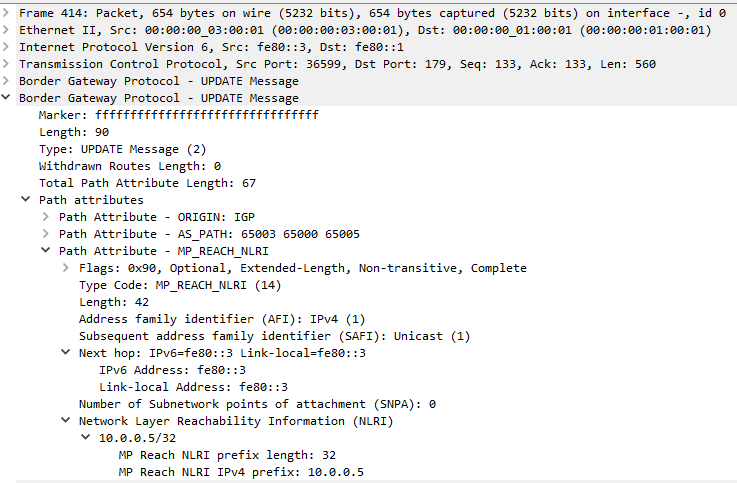

# Lab04. Построение Underlay сети (eBGP).

## Задание:
1. Собрать сеть с топологией CLOS;
2. Распределить адресное пространство для Underlay сети;
3. Настроить протокол eBGP в Underlay сети;
4. Зафиксировать в документации план работ, адресное пространство, схему сети, настройки;
5. Убедится в наличии IP связанности между устройствами.

### Соберём схему в PNETLab:


## Выполнение
Выделим адресное пространство.

Для IPv4 будем использовать адреса из сети 10.0.0.0/13 (RFC 1918).

Для IPv6 будем использовать случайно сгенерированный Unique Local префикс fdcd:c467:a7d3::0/48 (RFC 4193) и Link-local адреса fe80::/10.

Для сети управления (out-of-band management) будем использовать сеть 172.16.0.0/24.

### Таблица сетей:
|Сеть IPv4|Сеть IPv6|Назначение|
|--|--|--|
|10.0.0.0/13    |fdcd:c467:a7d3:1::/64      |Весь диапазон|
|10.0.0.0/24    |fdcd:c467:a7d3:1:0::/80    |Loopback 1|
|10.1.0.0/24    |fdcd:c467:a7d3:1:1::/80    |Loopback 2|
|-              |fe80::/10                  |point to point линки|
|10.3.0.0/24    |-                          |Резерв|
|10.4.0.0/14    |-                          |Сервисы|
|172.16.0.0/24  |-                          |OOB Management|

Построим Unnumbered IPv6 Underlay. 

В MP-BGP есть возможность распространять IPv4 NLRI c IPv6 Next Hop (RFC 8950).

На p2p интерфейсах между устройствами будут использоваться только Link-Local адреса. Можно оставить LL адреса, которые сгенерируются на интерфейсах автоматически, или для простоты назначить на все интерфейсы один и тот же адрес, например fe80::1/64.

Для удобства будем использовать разные LL адреса.

Назначим адреса на устройства, согласно таблице.

### Таблица адресов:
|Устройство|Интерфейс|Адрес IPv4|Адрес IPv6|Назначение|
|--|--|--|--|--|
|Spine01    |Ma1   |172.16.0.1/24  |-                          |OOB|
|           |Lo0   |10.0.0.1/32    |fdcd:c467:a7d3:1:0::1/128  |Loopback 1|
|           |Lo1   |10.1.0.1/32    |fdcd:c467:a7d3:1:1::1/128  |Loopback 2|
|			|Et1   |-              |fe80::1/64                 |p2p to Leaf1|
|			|Et2   |-              |fe80::1/64                 |p2p to Leaf2|
|			|Et3   |-              |fe80::1/64                 |p2p to Leaf3|
|Spine02    |Ma1   |172.16.0.2/24  |-                          |OOB|
|           |Lo0   |10.0.0.2/32    |fdcd:c467:a7d3:1:0::2/128  |Loopback 1|
|			|Lo1   |10.1.0.2/32    |fdcd:c467:a7d3:1:1::2/128  |Loopback 2|
|			|Et1   |-              |fe80::2/64                 |p2p to Leaf1|
|			|Et2   |-              |fe80::2/64                 |p2p to Leaf2|
|			|Et3   |-              |fe80::2/64                 |p2p to Leaf3|
|Leaf01     |Ma1   |172.16.0.3/24  |-                          |OOB|
|           |Lo0   |10.0.0.3/32    |fdcd:c467:a7d3:1:0::3/128  |Loopback 1|
|			|Lo1   |10.1.0.3/32    |fdcd:c467:a7d3:1:1::3/128  |Loopback 2|
|			|Et1   |-              |fe80::3/64                 |p2p to Spine01|
|			|Et2   |-              |fe80::3/64                 |p2p to Spine02|
|Leaf02     |Ma1   |172.16.0.4/24  |-                          |OOB|
|           |Lo0   |10.0.0.4/32    |fdcd:c467:a7d3:1:0::4/128  |Loopback 1|
|			|Lo1   |10.1.0.4/32    |fdcd:c467:a7d3:1:1::4/128  |Loopback 2|
|			|Et1   |-              |fe80::4/64                 |p2p to Spine01|
|			|Et2   |-              |fe80::4/64                 |p2p to Spine02|
|Leaf03     |Ma1   |172.16.0.5/24  |-                          |OOB|
|           |Lo0   |10.0.0.5/32    |fdcd:c467:a7d3:1:0::5/128  |Loopback 1|
|			|Lo1   |10.1.0.5/32    |fdcd:c467:a7d3:1:1::5/128  |Loopback 2|
|			|Et1   |-              |fe80::5/64                 |p2p to Spine01|
|			|Et2   |-              |fe80::5/64                 |p2p to Spine02|


Назначим устройствам ASN согласно таблице:
|Устройство|ASN|
|--|--|
|Spine01    |65000|
|Spine02    |65000|
|Leaf01     |65003|
|Leaf02     |65004|
|Leaf03     |65005|


Проверим IP связанность между Spine и Leaf (вывод сокращён):
```
Spine01#ping fe80::3 interface ethernet 1
Spine01#ping fe80::4 interface ethernet 2
Spine01#ping fe80::5 interface ethernet 3

Spine02#ping fe80::3 interface ethernet 1
Spine02#ping fe80::4 interface ethernet 2
Spine02#ping fe80::5 interface ethernet 3
```

Настроим eBGP для IPv4 и IPv6.

Для предотвращения path-hunting, коммутаторы spine будут в одной автономной системе.

Коммутаторы leaf будут в разных автономных системах.

В качестве RouterID будем использовать адрес интерфейса Loopback0.

Включим BFD, настроим аутентификацию для BGP, увеличим MTU, настроим шаблоны для BGP соседей, включим BGP multipath ECMP, настроим well-known community GRACEFUL_SHUTDOWN, установим MRAI=0.


Для примера приведем конфигурации Spine01 и Leaf01.

### Конфигурация Spine01:
```
Spine01(config)#
hostname Spine01

ip routing
ip routing ipv6 interfaces
ipv6 unicast-routing
no logging console
ip ping client source-interface loopback0
ip traceroute client source-interface loopback0
ip icmp source-interface loopback0

route-map rm_IPV4_CONNECTED permit 10
	match interface Loopback0
	exit
route-map rm_IPV6_CONNECTED permit 10
	match interface Loopback0
	exit
route-map rm_GSHUT permit 10
	set community GSHUT

router bgp 65000
	router-id 10.0.0.1
	maximum-paths 2 ecmp 2
	no bgp default ipv4-unicast
	bgp log-neighbor-changes
    neighbor LEAFS peer group
	neighbor LEAFS bfd
	neighbor LEAFS timers 1 3
	neighbor LEAFS password 0 P@$$w0rd
    neighbor LEAFS send-community standard extended
    neighbor LEAFS maximum-routes 12000
    neighbor LEAFS out-delay 0
	neighbor interface Et1 peer-group LEAFS remote-as 65003
	neighbor interface Et2 peer-group LEAFS remote-as 65004
	neighbor interface Et3 peer-group LEAFS remote-as 65005
	address-family ipv4
		neighbor LEAFS activate
		neighbor LEAFS next-hop address-family ipv6 originate
		redistribute connected route-map rm_IPV4_CONNECTED
	address-family ipv6
		neighbor LEAFS activate
		redistribute connected route-map rm_IPV6_CONNECTED

interface Management1
    mac-address 00:00:00:01:01:01
	ip address 172.16.0.1/24

interface loopback 0
    ip address 10.0.0.1/32
    ipv6 enable
    ipv6 address fdcd:c467:a7d3:1:0::1/128

interface loopback 1
    ip address 10.1.0.1/32
    ipv6 enable
    ipv6 address fdcd:c467:a7d3:1:1::1/128

interface ethernet 1-3
    no switchport
	mtu 9214
    ipv6 enable
    ipv6 address fe80::1 link-local
	bfd interval 100 min-rx 100 multiplier 3

interface ethernet 1
    description p2p to Leaf01
    mac-address 00:00:00:01:00:01

interface ethernet 2
    description p2p to Leaf02
    mac-address 00:00:00:01:00:02

interface ethernet 3
    description p2p to Leaf03
    mac-address 00:00:00:01:00:03
```


### Конфигурация Leaf01:
```
Leaf01(config)#
hostname Leaf01

ip routing
ip routing ipv6 interfaces
ipv6 unicast-routing
no logging console
ip ping client source-interface loopback0
ip traceroute client source-interface loopback0
ip icmp source-interface loopback0

route-map rm_IPV4_CONNECTED permit 10
	match interface Loopback0
	exit
route-map rm_IPV6_CONNECTED permit 10
	match interface Loopback0
	exit
route-map rm_GSHUT permit 10
	set community GSHUT

router bgp 65003
	router-id 10.0.0.3
	maximum-paths 2 ecmp 2
	no bgp default ipv4-unicast
	bgp log-neighbor-changes
    neighbor SPINES peer group
	neighbor SPINES bfd
	neighbor SPINES timers 1 3
	neighbor SPINES remote-as 65000
	neighbor SPINES password 0 P@$$w0rd
    neighbor SPINES send-community standard extended
    neighbor SPINES maximum-routes 12000
    neighbor SPINES out-delay 0
	neighbor interface Et1-2 peer-group SPINES
	address-family ipv4
		neighbor SPINES activate
		neighbor SPINES next-hop address-family ipv6 originate
		redistribute connected route-map rm_IPV4_CONNECTED
	address-family ipv6
		neighbor SPINES activate
		redistribute connected route-map rm_IPV6_CONNECTED

interface Management1
    mac-address 00:00:00:03:01:01
	ip address 172.16.0.3/24

interface loopback 0
    ip address 10.0.0.3/32
    ipv6 enable
    ipv6 address fdcd:c467:a7d3:1:0::3/128

interface loopback 1
    ip address 10.1.0.3/32
    ipv6 enable
    ipv6 address fdcd:c467:a7d3:1:1::3/128

interface ethernet 1-2
    no switchport
	mtu 9214
    ipv6 enable
    ipv6 address fe80::3 link-local
	bfd interval 100 min-rx 100 multiplier 3

interface ethernet 1
    description p2p to Spine01
    mac-address 00:00:00:03:00:01

interface ethernet 2
    description p2p to Spine02
    mac-address 00:00:00:03:00:02
```


На Spine01 проверим установление соседских отношений:
```
Spine01#show bgp summary
BGP summary information for VRF default
Router identifier 10.0.0.1, local AS number 65000
Neighbor             AS Session State AFI/SAFI                AFI/SAFI State   NLRI Rcd   NLRI Acc   NLRI Adv
----------- ----------- ------------- ----------------------- -------------- ---------- ---------- ----------
fe80::3%Et1       65003 Established   IPv4 Unicast            Negotiated              1          1          3
fe80::3%Et1       65003 Established   IPv6 Unicast            Negotiated              1          1          3
fe80::4%Et2       65004 Established   IPv4 Unicast            Negotiated              1          1          3
fe80::4%Et2       65004 Established   IPv6 Unicast            Negotiated              1          1          3
fe80::5%Et3       65005 Established   IPv4 Unicast            Negotiated              1          1          3
fe80::5%Et3       65005 Established   IPv6 Unicast            Negotiated              1          1          3
```
Видим, что соседские отношения установлены. У всех состояние Established.


Посмотрим таблицы маршрутизации IPv4 на Leaf01:
```
Leaf01#show ip bgp
BGP routing table information for VRF default
Router identifier 10.0.0.3, local AS number 65003

          Network                Next Hop              Metric  AIGP       LocPref Weight  Path
 * >      10.0.0.1/32            fe80::1%Et1           0       -          100     0       65000 i
 * >      10.0.0.2/32            fe80::2%Et2           0       -          100     0       65000 i
 * >      10.0.0.3/32            -                     -       -          -       0       i
 * >Ec    10.0.0.4/32            fe80::2%Et2           0       -          100     0       65000 65004 i
 *  ec    10.0.0.4/32            fe80::1%Et1           0       -          100     0       65000 65004 i
 * >Ec    10.0.0.5/32            fe80::2%Et2           0       -          100     0       65000 65005 i
 *  ec    10.0.0.5/32            fe80::1%Et1           0       -          100     0       65000 65005 i

Leaf01#show ip route
VRF: default
Gateway of last resort is not set
 B E      10.0.0.1/32 [200/0]
           via fe80::1, Ethernet1
 B E      10.0.0.2/32 [200/0]
           via fe80::2, Ethernet2
 C        10.0.0.3/32 [0/0]
           via Loopback0, directly connected
 B E      10.0.0.4/32 [200/0]
           via fe80::1, Ethernet1
           via fe80::2, Ethernet2
 B E      10.0.0.5/32 [200/0]
           via fe80::1, Ethernet1
           via fe80::2, Ethernet2
 C        10.1.0.3/32 [0/0]
           via Loopback1, directly connected
```
Видим маршруты до всех leaf и spine. Видим, что для IPv4 префиксов в качестве next hop указаны IPv6 lnik-local адреса.

Убедимся в этом и с помощью Wireshark, посмотрев анонс от Leaf01 к Spine01:


Видим, что в NLRI для IPv4 префикса указан IPv6 link-local адрес.

Посмотрим на маршрут до Leaf03 детально:
```
Leaf01#show ip bgp 10.0.0.5/32 detail
BGP routing table information for VRF default
Router identifier 10.0.0.3, local AS number 65003
BGP routing table entry for 10.0.0.5/32
 Paths: 2 available
  65000 65005
    fe80::1%Et1 from fe80::1%Et1 (10.0.0.1)
      Origin IGP, metric 0, localpref 100, IGP metric 1, weight 0, tag 0
      Received 02:21:26 ago, valid, external, ECMP head, ECMP, best, ECMP contributor
      Rx SAFI: Unicast
  65000 65005
    fe80::2%Et2 from fe80::2%Et2 (10.0.0.2)
      Origin IGP, metric 0, localpref 100, IGP metric 1, weight 0, tag 0
      Received 02:21:26 ago, valid, external, ECMP, ECMP contributor
      Not best: ECMP-Fast configured
      Rx SAFI: Unicast
 Advertised to 1 peer:
  peer-group SPINES:
    fe80::2%Et2
```
Видим, что BGP multipath и ECMP работают.


Посмотрим таблицы маршрутизации IPv6 на Leaf01:
```
Leaf01#show ipv6 bgp
BGP routing table information for VRF default
Router identifier 10.0.0.3, local AS number 65003

          Network                Next Hop              Metric  AIGP       LocPref Weight  Path
 * >      fdcd:c467:a7d3:1::1/128 fe80::1%Et1           0       -          100     0       65000 i
 * >      fdcd:c467:a7d3:1::2/128 fe80::2%Et2           0       -          100     0       65000 i
 * >      fdcd:c467:a7d3:1::3/128 -                     -       -          -       0       i
 * >Ec    fdcd:c467:a7d3:1::4/128 fe80::1%Et1           0       -          100     0       65000 65004 i
 *  ec    fdcd:c467:a7d3:1::4/128 fe80::2%Et2           0       -          100     0       65000 65004 i
 * >Ec    fdcd:c467:a7d3:1::5/128 fe80::1%Et1           0       -          100     0       65000 65005 i
 *  ec    fdcd:c467:a7d3:1::5/128 fe80::2%Et2           0       -          100     0       65000 65005 i

Leaf01#show ipv6 route
VRF: default

 B E      fdcd:c467:a7d3:1::1/128 [200/0]
           via fe80::1, Ethernet1
 B E      fdcd:c467:a7d3:1::2/128 [200/0]
           via fe80::2, Ethernet2
 C        fdcd:c467:a7d3:1::3/128 [0/0]
           via Loopback0, directly connected
 B E      fdcd:c467:a7d3:1::4/128 [200/0]
           via fe80::1, Ethernet1
           via fe80::2, Ethernet2
 B E      fdcd:c467:a7d3:1::5/128 [200/0]
           via fe80::1, Ethernet1
           via fe80::2, Ethernet2
 C        fdcd:c467:a7d3:1:1::3/128 [0/0]
           via Loopback1, directly connected
```
Так же видим маршруты до всех leaf и spine.


Проверим IP связанность между Leaf01 и Leaf02/03 по IPv4 и IPv6:
```
Leaf01#ping 10.0.0.4
PING 10.0.0.4 (10.0.0.4) from 10.0.0.3 : 72(100) bytes of data.
80 bytes from 10.0.0.4: icmp_seq=1 ttl=63 time=6.77 ms
80 bytes from 10.0.0.4: icmp_seq=2 ttl=63 time=4.31 ms
80 bytes from 10.0.0.4: icmp_seq=3 ttl=63 time=4.74 ms
80 bytes from 10.0.0.4: icmp_seq=4 ttl=63 time=4.51 ms
80 bytes from 10.0.0.4: icmp_seq=5 ttl=63 time=3.91 ms
--- 10.0.0.4 ping statistics ---
5 packets transmitted, 5 received, 0% packet loss, time 25ms
rtt min/avg/max/mdev = 3.913/4.848/6.769/0.998 ms, ipg/ewma 6.251/5.765 ms

Leaf01#ping fdcd:c467:a7d3:1:0::4
PING fdcd:c467:a7d3:1:0::4(fdcd:c467:a7d3:1::4) from fdcd:c467:a7d3:1::3 : 52 data bytes
60 bytes from fdcd:c467:a7d3:1::4: icmp_seq=1 ttl=63 time=4.98 ms
60 bytes from fdcd:c467:a7d3:1::4: icmp_seq=2 ttl=63 time=4.81 ms
60 bytes from fdcd:c467:a7d3:1::4: icmp_seq=3 ttl=63 time=3.43 ms
60 bytes from fdcd:c467:a7d3:1::4: icmp_seq=4 ttl=63 time=3.73 ms
60 bytes from fdcd:c467:a7d3:1::4: icmp_seq=5 ttl=63 time=2.90 ms
--- fdcd:c467:a7d3:1:0::4 ping statistics ---
5 packets transmitted, 5 received, 0% packet loss, time 21ms
rtt min/avg/max/mdev = 2.900/3.969/4.983/0.802 ms, ipg/ewma 5.144/4.422 ms

Leaf01#ping 10.0.0.5
Leaf01#ping fdcd:c467:a7d3:1:0::5
```

Проверим работоспособность BFD:
```
Spine01#show bfd peers
VRF name: default
-----------------
DstAddr              MyDisc         YourDisc       Interface/Transport         Type               LastUp             LastDown            LastDiag    State
------------- ---------------- ---------------- ------------------------- ------------ -------------------- -------------------- ------------------- -----
fe80::3          2810539973       2100731721             Ethernet1(22)       normal       05/09/26 18:50       05/09/26 18:50       No Diagnostic       Up
fe80::4          3741676449       1397129326             Ethernet2(21)       normal       05/09/26 17:38                   NA       No Diagnostic       Up
fe80::5          1782033342        637100779             Ethernet3(20)       normal       05/09/26 17:38                   NA       No Diagnostic       Up
```


Выведем из работы Spine01, например для обслуживания.

Проверим доступные пути с Leaf01 до Leaf03:
```
Leaf01#show ip route 10.0.0.5
VRF: default
B E      10.0.0.5/32 [200/0]
           via fe80::1, Ethernet1
           via fe80::2, Ethernet2
```
Видим ECMP маршрут через оба спайна.

Выполним трассировку с Leaf01 до Leaf03:
```
Leaf01#traceroute 10.0.0.5
traceroute to 10.0.0.5 (10.0.0.5), 30 hops max, 60 byte packets
 1  10.0.0.2 (10.0.0.2)  2.987 ms 10.0.0.1 (10.0.0.1)  3.436 ms 10.0.0.2 (10.0.0.2)  4.721 ms
 2  10.0.0.5 (10.0.0.5)  12.558 ms  13.836 ms  15.384 ms
```
Видим, что маршрут идёт через оба спайна.


На Spine01 анонсируем well-known community GRACEFUL_SHUTDOWN:
```
Spine01(config)#
router bgp 65000
    neighbor LEAFS route-map rm_GSHUT out
```

Снова посмотрим таблицы маршрутизации на Leaf01:
```
Leaf01#show ip bgp
BGP routing table information for VRF default
Router identifier 10.0.0.3, local AS number 65003

          Network                Next Hop              Metric  AIGP       LocPref Weight  Path
 * >      10.0.0.1/32            fe80::1%Et1           0       -          0       0       65000 i
 * >      10.0.0.2/32            fe80::2%Et2           0       -          100     0       65000 i
 * >      10.0.0.3/32            -                     -       -          -       0       i
 * >      10.0.0.4/32            fe80::2%Et2           0       -          100     0       65000 65004 i
 *        10.0.0.4/32            fe80::1%Et1           0       -          0       0       65000 65004 i
 * >      10.0.0.5/32            fe80::2%Et2           0       -          100     0       65000 65005 i
 *        10.0.0.5/32            fe80::1%Et1           0       -          0       0       65000 65005 i

Leaf01#show ip route
VRF: default
Gateway of last resort is not set
 B E      10.0.0.1/32 [200/0]
           via fe80::1, Ethernet1
 B E      10.0.0.2/32 [200/0]
           via fe80::2, Ethernet2
 C        10.0.0.3/32 [0/0]
           via Loopback0, directly connected
 B E      10.0.0.4/32 [200/0]
           via fe80::2, Ethernet2
 B E      10.0.0.5/32 [200/0]
           via fe80::2, Ethernet2
 C        10.1.0.3/32 [0/0]
           via Loopback1, directly connected
```
Видим, что теперь до Leaf02 и Leaf03 есть только один активный маршрут через Spine02.

Снова выполним трассировку с Leaf01 до Leaf03:
```
Leaf01#traceroute 10.0.0.5
traceroute to 10.0.0.5 (10.0.0.5), 30 hops max, 60 byte packets
 1  10.0.0.2 (10.0.0.2)  8.230 ms  8.288 ms  10.473 ms
 2  10.0.0.5 (10.0.0.5)  11.267 ms  15.095 ms  15.923 ms
```
Теперь трафик идёт только через Spine02.


### На этом настройка BGP Underlay закончена.

