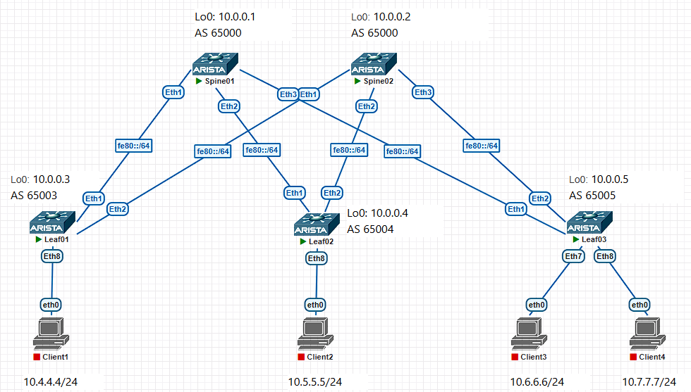

# Lab04. Построение Underlay сети (eBGP).

## Задание:
1. Собрать сеть с топологией CLOS;
2. Распределить адресное пространство для Underlay сети;
3. Настроить протокол eBGP в Underlay сети;
4. Зафиксировать в документации план работ, адресное пространство, схему сети, настройки;
5. Убедится в наличии IP связанности между устройствами в IS-IS домене.

### Соберём схему в PNETLab:


## Выполнение
Выделим адресное пространство.

Для IPv4 будем использовать адреса из сети 10.0.0.0/13 (RFC 1918).

Для IPv6 будем использовать случайно сгенерированный Unique Local префикс fdcd:c467:a7d3::0/48 (RFC 4193) и Link-local адреса fe80::/10.

Для сети управления (out-of-band management) будем использовать сеть 172.16.0.0/24.

### Таблица сетей:
|Сеть IPv4|Сеть IPv6|Назначение|
|--|--|--|
|10.0.0.0/13    |fdcd:c467:a7d3:1::/64      |Весь диапазон|
|10.0.0.0/24    |fdcd:c467:a7d3:1:0::/80    |Loopback 1|
|10.1.0.0/24    |fdcd:c467:a7d3:1:1::/80    |Loopback 2|
|10.2.0.0/24    |fe80::/10                  |point to point линки|
|10.3.0.0/24    |-                          |Резерв|
|10.4.0.0/14    |-                          |Сервисы|
|172.16.0.0/24  |-                          |OOB Management|

Назначим адреса на устройства, согласно таблице.

### Таблица адресов:
|Устройство|Интерфейс|Адрес IPv4|Адрес IPv6|Назначение|
|--|--|--|--|--|
|Spine01    |Ma1   |172.16.0.1/24  |-                          |OOB|
|           |Lo0   |10.0.0.1/32    |fdcd:c467:a7d3:1:0::1/128  |Loopback 1|
|           |Lo1   |10.1.0.1/32    |fdcd:c467:a7d3:1:1::1/128  |Loopback 2|
|			|Et1   |10.2.1.0/31    |fe80::1/64                 |p2p to Leaf1|
|			|Et2   |10.2.1.2/31    |fe80::1/64                 |p2p to Leaf2|
|			|Et3   |10.2.1.4/31    |fe80::1/64                 |p2p to Leaf3|
|Spine02    |Ma1   |172.16.0.2/24  |-                          |OOB|
|           |Lo0   |10.0.0.2/32    |fdcd:c467:a7d3:1:0::2/128  |Loopback 1|
|			|Lo1   |10.1.0.2/32    |fdcd:c467:a7d3:1:1::2/128  |Loopback 2|
|			|Et1   |10.2.2.0/31    |fe80::2/64                 |p2p to Leaf1|
|			|Et2   |10.2.2.2/31    |fe80::2/64                 |p2p to Leaf2|
|			|Et3   |10.2.2.4/31    |fe80::2/64                 |p2p to Leaf3|
|Leaf01     |Ma1   |172.16.0.3/24  |-                          |OOB|
|           |Lo0   |10.0.0.3/32    |fdcd:c467:a7d3:1:0::3/128  |Loopback 1|
|			|Lo1   |10.1.0.3/32    |fdcd:c467:a7d3:1:1::3/128  |Loopback 2|
|			|Et1   |10.2.1.1/31    |fe80::3/64                 |p2p to Spine01|
|			|Et2   |10.2.2.1/31    |fe80::3/64                 |p2p to Spine02|
|Leaf02     |Ma1   |172.16.0.4/24  |-                          |OOB|
|           |Lo0   |10.0.0.4/32    |fdcd:c467:a7d3:1:0::4/128  |Loopback 1|
|			|Lo1   |10.1.0.4/32    |fdcd:c467:a7d3:1:1::4/128  |Loopback 2|
|			|Et1   |10.2.1.3/31    |fe80::4/64                 |p2p to Spine01|
|			|Et2   |10.2.2.3/31    |fe80::4/64                 |p2p to Spine02|
|Leaf03     |Ma1   |172.16.0.5/24  |-                          |OOB|
|           |Lo0   |10.0.0.5/32    |fdcd:c467:a7d3:1:0::5/128  |Loopback 1|
|			|Lo1   |10.1.0.5/32    |fdcd:c467:a7d3:1:1::5/128  |Loopback 2|
|			|Et1   |10.2.1.5/31    |fe80::5/64                 |p2p to Spine01|
|			|Et2   |10.2.2.5/31    |fe80::5/64                 |p2p to Spine02|


Проверим IP связанность между Spine и Leaf (вывод сокращён):
```
Spine01#ping 10.2.1.1
Spine01#ping 10.2.1.3
Spine01#ping 10.2.1.5
Spine01#ping fe80::3 interface ethernet 1
Spine01#ping fe80::4 interface ethernet 2
Spine01#ping fe80::5 interface ethernet 3

Spine02#ping 10.2.2.1
Spine02#ping 10.2.2.3
Spine02#ping 10.2.2.5
Spine02#ping fe80::3 interface ethernet 1
Spine02#ping fe80::4 interface ethernet 2
Spine02#ping fe80::5 interface ethernet 3
```

Настроим IS-IS для IPv4 и IPv6.

Все устройства будут в одной зоне 49.0001 и будут строить отношения уровня 1 и 2.

В качестве RouterID будем использовать адрес интерфейса Loopback0.

Интерфейсы Loopback0 и другие, не участвующие в IS-IS, сдлаем пассивными.

Включим BFD, настроим аутентификацию для IS-IS и изменим тип линков на point-to-point.


Для примера приведем конфигурации Spine01 и Leaf01.

### Конфигурация Spine01:
```
Spine01(config)#
hostname Spine01

ip routing
ipv6 unicast-routing
no logging console

router isis UNDERISIS
	net 49.0001.0100.0000.0001.00
	router-id ipv4 10.0.0.1
	log-adjacency-changes
	address-family ipv4 unicast
	address-family ipv6 unicast
	authentication mode md5
	authentication key P@$$w0rd

interface Management1
    mac-address 00:00:00:01:01:01
	ip address 172.16.0.1/24

interface loopback 0
    ip address 10.0.0.1/32
    ipv6 enable
    ipv6 address fdcd:c467:a7d3:1:0::1/128
    isis enable UNDERISIS
	isis passive

interface loopback 1
    ip address 10.1.0.1/32
    ipv6 enable
    ipv6 address fdcd:c467:a7d3:1:1::1/128
	isis passive

interface ethernet 1-3
    no switchport
    ipv6 enable
    ipv6 address fe80::1 link-local
	bfd interval 100 min-rx 100 multiplier 3
	isis authentication mode md5
	isis authentication key P@$$w0rd
    isis enable UNDERISIS
    isis bfd
    isis ipv6 bfd
    isis network point-to-point

interface ethernet 1
    description p2p to Leaf01
    mac-address 00:00:00:01:00:01
    ip address 10.2.1.0/31

interface ethernet 2
    description p2p to Leaf02
    mac-address 00:00:00:01:00:02
    ip address 10.2.1.2/31

interface ethernet 3
    description p2p to Leaf03
    mac-address 00:00:00:01:00:03
    ip address 10.2.1.4/31

interface ethernet 4-8
	isis passive

interface ethernet 4
    mac-address 00:00:00:01:00:04
interface ethernet 5
    mac-address 00:00:00:01:00:05
interface ethernet 6
    mac-address 00:00:00:01:00:06
interface ethernet 7
    mac-address 00:00:00:01:00:07
interface ethernet 8
    mac-address 00:00:00:01:00:08

```


### Конфигурация Leaf01:
```
Leaf01(config)#
hostname Leaf01

ip routing
ipv6 unicast-routing
no logging console

router isis UNDERISIS
	net 49.0001.0100.0000.0003.00
	router-id ipv4 10.0.0.3
	log-adjacency-changes
	address-family ipv4 unicast
	address-family ipv6 unicast
	authentication mode md5
	authentication key P@$$w0rd

interface Management1
    mac-address 00:00:00:03:01:01
	ip address 172.16.0.3/24

interface loopback 0
    ip address 10.0.0.3/32
    ipv6 enable
    ipv6 address fdcd:c467:a7d3:1:0::3/128
    isis enable UNDERISIS
	isis passive

interface loopback 1
    ip address 10.1.0.3/32
    ipv6 enable
    ipv6 address fdcd:c467:a7d3:1:1::3/128
	isis passive

interface ethernet 1-2
    no switchport
    ipv6 enable
    ipv6 address fe80::3 link-local
	bfd interval 100 min-rx 100 multiplier 3
	isis authentication key P@$$w0rd
	isis authentication mode md5
    isis enable UNDERISIS
    isis bfd
    isis ipv6 bfd
    isis network point-to-point

interface ethernet 1
    description p2p to Spine01
    mac-address 00:00:00:03:00:01
    ip address 10.2.1.1/31

interface ethernet 2
    description p2p to Spine02
    mac-address 00:00:00:03:00:02
    ip address 10.2.2.1/31

interface ethernet 3-8
	isis passive

interface ethernet 3
    mac-address 00:00:00:03:00:03
interface ethernet 4
    mac-address 00:00:00:03:00:04
interface ethernet 5
    mac-address 00:00:00:03:00:05
interface ethernet 6
    mac-address 00:00:00:03:00:06
interface ethernet 7
    mac-address 00:00:00:03:00:07
interface ethernet 8
    mac-address 00:00:00:03:00:08
```


На Spine01 проверим установление соседских отношений:
```
Spine01#show isis neighbors detail

Instance  VRF      System Id        Type Interface          SNPA              State Hold time   Circuit Id
UNDERISIS default  Leaf01           L1L2 Ethernet1          P2P               UP    20          11
  Area addresses: 49.0001
  SNPA: P2P
  Router ID: 0.0.0.0
  Advertised Hold Time: 30
  State Changed: 00:17:22 ago at 2026-04-28 18:53:23
  IPv4 Interface Address: 10.2.1.1
  IPv6 Interface Address: fe80::3
  Interface name: Ethernet1
  Graceful Restart: Supported
  BFD IPv4 state is up
  BFD IPv6 state is up
  Supported Address Families: IPv4, IPv6
  Neighbor Supported Address Families: IPv4, IPv6
UNDERISIS default  Leaf02           L1L2 Ethernet2          P2P               UP    23          15
  Area addresses: 49.0001
  SNPA: P2P
  Router ID: 0.0.0.0
  Advertised Hold Time: 30
  State Changed: 00:05:07 ago at 2026-04-28 19:05:38
  IPv4 Interface Address: 10.2.1.3
  IPv6 Interface Address: fe80::4
  Interface name: Ethernet2
  Graceful Restart: Supported
  BFD IPv4 state is up
  BFD IPv6 state is up
  Supported Address Families: IPv4, IPv6
  Neighbor Supported Address Families: IPv4, IPv6
UNDERISIS default  Leaf03           L1L2 Ethernet3          P2P               UP    22          16
  Area addresses: 49.0001
  SNPA: P2P
  Router ID: 0.0.0.0
  Advertised Hold Time: 30
  State Changed: 00:02:17 ago at 2026-04-28 19:08:28
  IPv4 Interface Address: 10.2.1.5
  IPv6 Interface Address: fe80::5
  Interface name: Ethernet3
  Graceful Restart: Supported
  BFD IPv4 state is up
  BFD IPv6 state is up
  Supported Address Families: IPv4, IPv6
  Neighbor Supported Address Families: IPv4, IPv6
```
Видим, что соседские отношения установлены. У всех состояние UP. Уровень отношений смешанный L1/L2. BFD включен. Тип линков p2p.


Посмотрим LSDB:
```
Spine01#show isis database
Legend:
H - hostname conflict
U - node unreachable

IS-IS Instance: UNDERISIS VRF: default
  IS-IS Level 1 Link State Database
    LSPID                   Seq Num  Cksum  Life Length IS  Received LSPID        Flags
    Spine01.00-00                 8  24235  1149    209 L2  0100.0000.0001.00-00  <>
    Spine02.00-00                 8  40476   840    209 L2  0100.0000.0002.00-00  <>
    Leaf01.00-00                  6  35121   590    184 L2  0100.0000.0003.00-00  <>
    Leaf02.00-00                  7  17229   957    184 L2  0100.0000.0004.00-00  <>
    Leaf03.00-00                  7  64747  1188    184 L2  0100.0000.0005.00-00  <>
  IS-IS Level 2 Link State Database
    LSPID                   Seq Num  Cksum  Life Length IS  Received LSPID        Flags
    Spine01.00-00                12  34916  1078    364 L2  0100.0000.0001.00-00  <>
    Spine02.00-00                12  15082   874    364 L2  0100.0000.0002.00-00  <>
    Leaf01.00-00                 10  61522   627    348 L2  0100.0000.0003.00-00  <>
    Leaf02.00-00                 10  20125   887    348 L2  0100.0000.0004.00-00  <>
    Leaf03.00-00                  8  25942  1056    348 L2  0100.0000.0005.00-00  <>
```

Посмотрим состояние интерфейсов:
```
Spine01#show isis interface brief
IS-IS Instance: UNDERISIS VRF: default
Interface Level IPv4 Metric IPv6 Metric Type           Adjacency
--------- ----- ----------- ----------- -------------- ---------
Ethernet1 L1L2           10          10 point-to-point         2
Ethernet2 L1L2           10          10 point-to-point         2
Ethernet3 L1L2           10          10 point-to-point         2
Loopback0 L1L2           10          10 loopback       (passive)
```
Видим, что установился уровень отношений L1/L2, тип линков p2p, и по два соседства на каждый линк (L1 соседство + L2 соседство).


На Spine01 проверим таблицу маршрутизации IPv4:
```
Spine01#show ip route
VRF: default
Gateway of last resort is not set

 C        10.0.0.1/32
           directly connected, Loopback0
 I L1     10.0.0.2/32 [115/30]
           via 10.2.1.1, Ethernet1
           via 10.2.1.3, Ethernet2
           via 10.2.1.5, Ethernet3
 I L1     10.0.0.3/32 [115/20]
           via 10.2.1.1, Ethernet1
 I L1     10.0.0.4/32 [115/20]
           via 10.2.1.3, Ethernet2
 I L1     10.0.0.5/32 [115/20]
           via 10.2.1.5, Ethernet3
 C        10.1.0.1/32
           directly connected, Loopback1
 C        10.2.1.0/31
           directly connected, Ethernet1
 C        10.2.1.2/31
           directly connected, Ethernet2
 C        10.2.1.4/31
           directly connected, Ethernet3
 I L1     10.2.2.0/31 [115/20]
           via 10.2.1.1, Ethernet1
 I L1     10.2.2.2/31 [115/20]
           via 10.2.1.3, Ethernet2
 I L1     10.2.2.4/31 [115/20]
           via 10.2.1.5, Ethernet3
```
Видим маршруты до Loopback интерфейсов всех устройств, в том числе три маршрута через три лифа до Spine02.

На Spine01 проверим таблицу маршрутизации IPv6:
```
Spine01#show ipv6 route
VRF: default
Displaying 6 of 9 IPv6 routing table entries

 C        fdcd:c467:a7d3:1::1/128 [0/0]
           via Loopback0, directly connected
 I L1     fdcd:c467:a7d3:1::2/128 [115/30]
           via fe80::3, Ethernet1
           via fe80::4, Ethernet2
           via fe80::5, Ethernet3
 I L1     fdcd:c467:a7d3:1::3/128 [115/20]
           via fe80::3, Ethernet1
 I L1     fdcd:c467:a7d3:1::4/128 [115/20]
           via fe80::4, Ethernet2
 I L1     fdcd:c467:a7d3:1::5/128 [115/20]
           via fe80::5, Ethernet3
 C        fdcd:c467:a7d3:1:1::1/128 [0/0]
           via Loopback1, directly connected
```
Так же видим маршруты до Loopback интерфейсов всех устройств.


Проверим IP связанность между Spine01 и Leaf01 по IPv4 и IPv6:
```
Spine01#ping 10.0.0.3
PING 10.0.0.3 (10.0.0.3) 72(100) bytes of data.
80 bytes from 10.0.0.3: icmp_seq=1 ttl=64 time=2.23 ms
80 bytes from 10.0.0.3: icmp_seq=2 ttl=64 time=2.31 ms
80 bytes from 10.0.0.3: icmp_seq=3 ttl=64 time=2.48 ms
80 bytes from 10.0.0.3: icmp_seq=4 ttl=64 time=2.27 ms
80 bytes from 10.0.0.3: icmp_seq=5 ttl=64 time=1.96 ms
--- 10.0.0.3 ping statistics ---
5 packets transmitted, 5 received, 0% packet loss, time 10ms
rtt min/avg/max/mdev = 1.961/2.249/2.477/0.166 ms, ipg/ewma 2.463/2.233 ms

Spine01#ping fdcd:c467:a7d3:1:0::3
PING fdcd:c467:a7d3:1:0::3(fdcd:c467:a7d3:1::3) 52 data bytes
60 bytes from fdcd:c467:a7d3:1::3: icmp_seq=1 ttl=64 time=3.39 ms
60 bytes from fdcd:c467:a7d3:1::3: icmp_seq=2 ttl=64 time=3.05 ms
60 bytes from fdcd:c467:a7d3:1::3: icmp_seq=3 ttl=64 time=2.59 ms
60 bytes from fdcd:c467:a7d3:1::3: icmp_seq=4 ttl=64 time=2.83 ms
60 bytes from fdcd:c467:a7d3:1::3: icmp_seq=5 ttl=64 time=4.39 ms
--- fdcd:c467:a7d3:1:0::3 ping statistics ---
5 packets transmitted, 5 received, 0% packet loss, time 13ms
rtt min/avg/max/mdev = 2.590/3.249/4.389/0.628 ms, ipg/ewma 3.185/3.349 ms
```

Проверим IP связанность между Spine01 и Spine02/Leaf02/Leaf03 по IPv4 и IPv6 (вывод сокращён):
```
Spine01#ping 10.0.0.2
Spine01#ping fdcd:c467:a7d3:1:0::2

Spine01#ping 10.0.0.4
Spine01#ping fdcd:c467:a7d3:1:0::4

Spine01#ping 10.0.0.5
Spine01#ping fdcd:c467:a7d3:1:0::5
```


Проверим работоспособность BFD:
```
Spine01#show bfd peers
VRF name: default
-----------------
DstAddr       MyDisc    YourDisc  Interface/Transport    Type           LastUp
--------- ----------- ----------- -------------------- ------- ----------------
10.2.1.1  1266665523  2462916651        Ethernet1(16)  normal   04/29/26 08:44
10.2.1.3  3299483478     2328633        Ethernet2(22)  normal   05/01/26 13:01
10.2.1.5   327267910  2137237654        Ethernet3(23)  normal   05/01/26 13:01

   LastDown            LastDiag    State
-------------- ------------------- -----
         NA       No Diagnostic       Up
         NA       No Diagnostic       Up
         NA       No Diagnostic       Up

DstAddr     MyDisc   YourDisc Interface/Transport   Type         LastUp LastDown
------- ---------- ---------- ------------------- ------ -------------- --------
fe80::3 2822492478  406306921       Ethernet1(16) normal 04/29/26 08:44       NA
fe80::4 3773810009  499073101       Ethernet2(22) normal 05/01/26 13:01       NA
fe80::5  959282347 1584485204       Ethernet3(23) normal 05/01/26 13:01       NA

        LastDiag    State
------------------- -----
   No Diagnostic       Up
   No Diagnostic       Up
   No Diagnostic       Up
```


Выведем из работы Spine01, например для обслуживания.

Посмотрим LSDB на Spine01:
```
Spine01#show isis database
IS-IS Instance: UNDERISIS VRF: default
  IS-IS Level 1 Link State Database
    LSPID                   Seq Num  Cksum  Life Length IS  Received LSPID        Flags
    Spine01.00-00               325  29663  1087    209 L2  0100.0000.0001.00-00  <>
    Spine02.00-00               322  32119   991    209 L2  0100.0000.0002.00-00  <>
    Leaf01.00-00                310  29838   618    184 L2  0100.0000.0003.00-00  <>
    Leaf02.00-00                322  31840  1105    184 L2  0100.0000.0004.00-00  <>
    Leaf03.00-00                319  64896   749    184 L2  0100.0000.0005.00-00  <>
  IS-IS Level 2 Link State Database
    LSPID                   Seq Num  Cksum  Life Length IS  Received LSPID        Flags
    Spine01.00-00               342  42317  1087    364 L2  0100.0000.0001.00-00  <>
    Spine02.00-00               340  34174   991    364 L2  0100.0000.0002.00-00  <>
    Leaf01.00-00                326  16681   945    348 L2  0100.0000.0003.00-00  <>
    Leaf02.00-00                333  53561   724    348 L2  0100.0000.0004.00-00  <>
    Leaf03.00-00                331   5398   734    348 L2  0100.0000.0005.00-00  <>
```

Проверим доступные пути с Leaf03 до Leaf01:
```
Leaf03#show ip route 10.0.0.3
VRF: default
I L1     10.0.0.3/32 [115/30]
           via 10.2.1.4, Ethernet1
           via 10.2.2.4, Ethernet2
```
Видим ECMP маршрут через оба спайна.

Выполним трассировку с Leaf03 до Leaf01:
```
Leaf03#traceroute 10.0.0.3
traceroute to 10.0.0.3 (10.0.0.3), 30 hops max, 60 byte packets
 1  10.2.1.4 (10.2.1.4)  4.349 ms  4.692 ms  4.645 ms
 2  10.0.0.3 (10.0.0.3)  19.907 ms  19.897 ms  22.414 ms
```
Видим, что маршрут идёт через Spine01.


На Spine01 установим в IS-IS бит Overload:
```
Spine01(config)#
router isis UNDERISIS
    set-overload-bit
```

Посмотрим LSDB на Spine01:
```
Spine01#show isis database
IS-IS Instance: UNDERISIS VRF: default
  IS-IS Level 1 Link State Database
    LSPID                   Seq Num  Cksum  Life Length IS  Received LSPID        Flags
    Spine01.00-00               326  23625  1193    209 L2  0100.0000.0001.00-00  <DBOverload>
    Spine02.00-00               323  55422  1077    209 L2  0100.0000.0002.00-00  <>
    Leaf01.00-00                310  29838   471    184 L2  0100.0000.0003.00-00  <>
    Leaf02.00-00                322  31840   959    184 L2  0100.0000.0004.00-00  <>
    Leaf03.00-00                319  64896   602    184 L2  0100.0000.0005.00-00  <>
  IS-IS Level 2 Link State Database
    LSPID                   Seq Num  Cksum  Life Length IS  Received LSPID        Flags
    Spine01.00-00               343  31790  1193    209 L2  0100.0000.0001.00-00  <DBOverload>
    Spine02.00-00               340  34174   844    364 L2  0100.0000.0002.00-00  <>
    Leaf01.00-00                326  16681   799    348 L2  0100.0000.0003.00-00  <>
    Leaf02.00-00                333  53561   578    348 L2  0100.0000.0004.00-00  <>
    Leaf03.00-00                331   5398   588    348 L2  0100.0000.0005.00-00  <>
```
Видим, что бит Overload установлен на Spine01.


Посмотрим LSDB на Leaf03:
```
Leaf03#show isis database
IS-IS Instance: UNDERISIS VRF: default
  IS-IS Level 1 Link State Database
    LSPID                   Seq Num  Cksum  Life Length IS  Received LSPID        Flags
    Spine01.00-00               326  23625  1150    209 L2  0100.0000.0001.00-00  <DBOverload>
    Spine02.00-00               323  55422  1035    209 L2  0100.0000.0002.00-00  <>
    Leaf01.00-00                310  29838   429    184 L2  0100.0000.0003.00-00  <>
    Leaf02.00-00                322  31840   916    184 L2  0100.0000.0004.00-00  <>
    Leaf03.00-00                319  64896   560    184 L2  0100.0000.0005.00-00  <>
  IS-IS Level 2 Link State Database
    LSPID                   Seq Num  Cksum  Life Length IS  Received LSPID        Flags
    Spine01.00-00               343  31790  1150    209 L2  0100.0000.0001.00-00  <DBOverload>
    Spine02.00-00               340  34174   802    364 L2  0100.0000.0002.00-00  <>
    Leaf01.00-00                326  16681   756    348 L2  0100.0000.0003.00-00  <>
    Leaf02.00-00                333  53561   536    348 L2  0100.0000.0004.00-00  <>
    Leaf03.00-00                331   5398   546    348 L2  0100.0000.0005.00-00  <>
```
Так же видим, что бит Overload установлен на Spine01.


Проверим доступные пути с Leaf03 до Leaf01:
```
Leaf03#show ip route 10.0.0.3
VRF: default
 I L1     10.0.0.3/32 [115/30]
           via 10.2.2.4, Ethernet2
```
Видим только один маршрут через Spine02.


Выполним трассировку:
```
Leaf03#traceroute 10.0.0.3
traceroute to 10.0.0.3 (10.0.0.3), 30 hops max, 60 byte packets
 1  10.2.2.4 (10.2.2.4)  5.702 ms  6.476 ms  13.435 ms
 2  10.0.0.3 (10.0.0.3)  13.558 ms  15.910 ms  16.043 ms
```
Видим, что теперь трафик идет через Spine02.


### На этом настройка IS-IS закончена.

